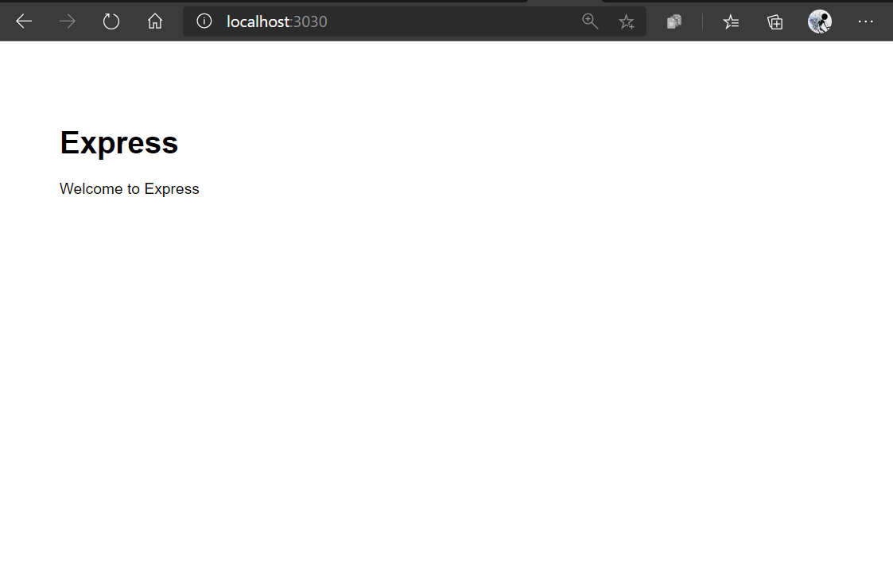
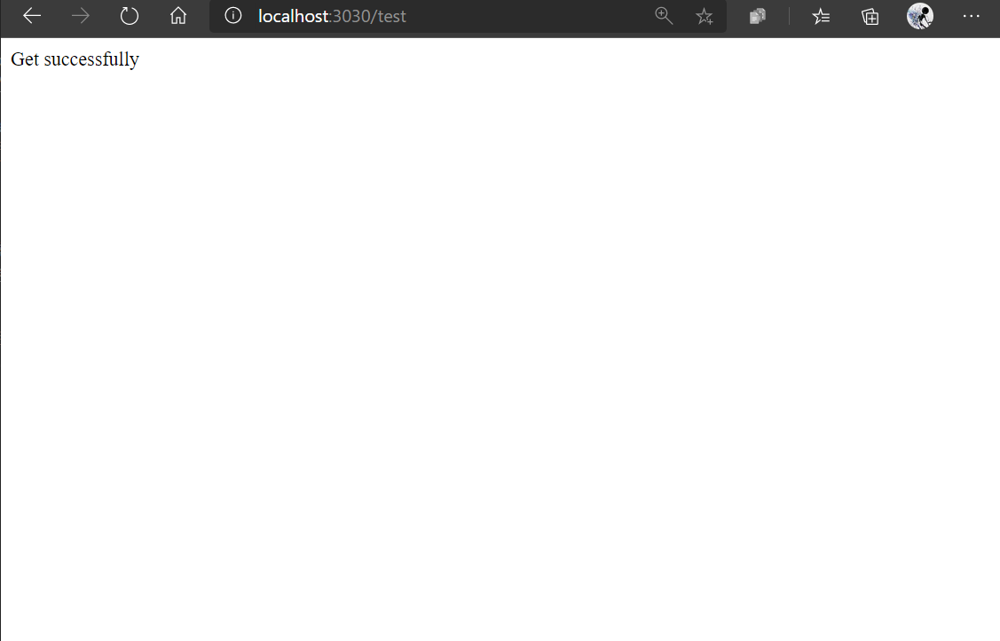
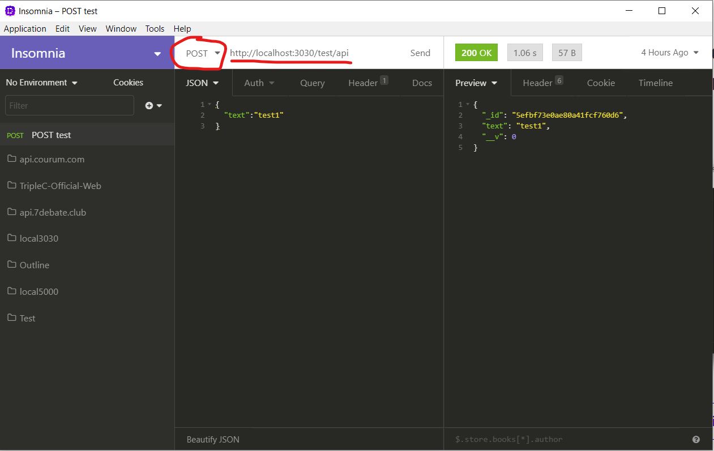

# Triple C 2020 Summer / Fall 选拔 Assignment: Express.js + MongoDB

**Due date: 2020年8月31日 11:59 PM**  
我们会以due date之前你的最后一次commit作为参考标准

## 开始之前
在开始之前，请确保你对以下知识有一定了解：
- JavaScript
- 什么是JSON
- Http Request  
- 什么是数据库  
- npm (会最基础的使用方法即可)

如果上述条目中有任意一个完全不知道，请先自学，或移步
 [静态网页 (HTML+CSS)](https://github.com/dekunma/TripleC_20Summer_PreAssignments/tree/master/HTML-starter) 

这不是一个轻松的项目，我们也不expect你能在两个月内完整完成这个项目  
部分完成项目不代表失去选拔资格  
代码写了多少交多少就可以，我们会根据完成情况酌情考虑

## 项目简介：
在本次项目中，你将用Express.js完成一个基础的人员管理系统  
你的MongoDB数据库中会有一个叫```Persons```的Collection  
这个Collection里每一条数据代表一个```Person```  
你需要实现的后端与数据库的交互功能有：  

- 查看数据库中的所有人员（```Persons```这个Collection里的所有数据）
- 增加新人员 （在数据库里新增一条```Person```）
- 删除已有人员 （在数据库里删除一条```Person```）
- 改变某一个人员的数据 （在数据库里改变某一条```Person```的数据）

## Get Started
1. clone或download这个repo到本地  
2. 安装[node.js](https://nodejs.org/)（会自动安装npm）
3. 安装```MongoDB```或在[MongoAtlas](https://cloud.mongodb.com)注册并创建MongoDB数据库  
   **MongoDB的安装方法或MongoAtlas的使用方法请自行上网查询**  
   MongoAtlas的使用方法也可以结合这个教程学习：[教程](https://www.youtube.com/watch?v=KKyag6t98g8)
4. ```cd```进入```Express-starter```这个文件夹
5. shell / terminal执行 ```npm install```  
6. 成功后，进入```config```文件夹中的```default.js```，把```mongodb_key```改成你的MongoDB connection string
   **什么是MongoDB connection string请自行上网查询**

7. 执行```npm start```，然后访问```http://localhost:3030```，你应该能看到Express的欢迎页：


## 测试
1. 访问```http://localhost:3030/test```，你应该会看到```Get successfully```  
此时你相当于向 ```http://localhost:3030/test``` 发出了```GET```请求，并收到了回应


2. 下载并安装[Insomnia Core](https://insomnia.rest/)  
    **同时请阅读insomnia官方文档了解insomnia是干什么的**  

3. 用insomnia向```http://localhost:3030/test/api``` **POST** 如下JSON文件：
```json
{
    "text":"任意内容"
}
```
你应该可以看到回应，并且这条数据已经存在了你MongoDB数据库中的```Tests``` collection里  
  

## 学习Express.js，Mongoose和MongoDB
- [Express官方文档](https://expressjs.com/)
- [Mongoose官方文档](https://mongoosejs.com/)
- [Express Crash Course](https://www.youtube.com/watch?v=L72fhGm1tfE)
- [Express+Mongoose](https://www.youtube.com/watch?v=k_0ZzvHbNBQ&list=PLillGF-RfqbYRpji8t4SxUkMxfowG4Kqp)
- [MongoAtlas](https://www.youtube.com/watch?v=KKyag6t98g8)
- 其他Express.js，Mongoose，和MongoDB的教程请自行上网查找

这些教程仅供参考  
可以自己再去找其他资源学习

## TODO：
1. 创建一个新的```Persons```的Schema(Model)  
    每个collection都需要有自己的Schema（Schema的例子：```models/test.model.js```）
    每一条```Person```数据需要有这个```Person```的：
    - ```name``` 
    - ```age```
    - ```gender```
    - ```weight```
    - ```height```
    - ```isMarried``` （是否已婚）
        
    请自行选择适合这些Key的数据类型  
      
    **其他要求**：
    - 每个```Person```都必须要有```name```，没有提供```name```则不能创建一个新的```Person```
    - 其他Key在```POST```时如果没有提供，则在数据库里记录的value是你给这个key设置的默认值


2.  创建完```Person```的Schema之后，在```controllers```文件夹里创建```person```的controller.  
    Controller的具体例子请参考```test.controller.js```  
      
    之后在```app.js```里配置```persons```这个service  
    具体请参考```app.js```中```test```这个service是如何配置的  

3. ```Person```的controller具体需要干什么：  
    - 发送```GET```请求到```http://localhost:3030/persons/all```  
    会返回数据库里所有persons的数据  
      
    - 可以```POST``` 一条JSON data 到 ```http://localhost:3030/persons/new```  
    并将其储存在服务器中  
      
    **Example:**  
    Post这条数据：
    ```json
    {
        "name":"William",
        "age":19,
        "gender":"male",
        "weight":68,
        "height":179,
        "isMarried":false
    }
    ```

    返回的结果：
    ```json
    {
        "_id":"5efbf73e0ae80a41fcf760d6",
        "name":"William",
        "age":19,
        "gender":"male",
        "weight":68,
        "height":179,
        "isMarried":false,
        "__v": 0
    }
    ```

    Post这条数据：
    ```json
    {
        "name":"William",
    }
    ```
    返回的结果：
    ```json
    {
        "_id":"5eee1994ed2cb50baf22b1a6",
        "name":"William",
        "age": -1,
        "gender":"unknown",
        "weight": -1,
        "height": -1,
        "isMarried" : null,
        "__v": 0
    }    
    ```

    可以看到，我给```age```设的默认值是-1，```gender```是```"unknow"```，依此类推  
    你设置的默认值不一定要与我一样  
    （比方说你可以觉得```age```的默认值是0的话更合理）


    - 可以发送```DELETE```请求到```http://localhost:3030/persons/delete/:id```  
    **Example**:
    发送```DELETE```到```http://localhost:3030/persons/delete/5eee1994ed2cb50baf22b1a6```  
        返回的结果：
    ```json
    {
        "_id":"5eee1994ed2cb50baf22b1a6",
        "age": -1,
        "gender":"unknown",
        "weight": -1,
        "height": -1,
        "isMarried" : null,
        "__v": 0
    }    
    ```  
    且这条数据已经在服务器里被删除  

    - 可以发送```PATCH```请求到```http://localhost:3030/persons/patch/:id```  
    **Example**:   
    发送```PATCH```请求到```http://localhost:3030/persons/patch/5efbf73e0ae80a41fcf760d6```  
    with 这一段data:   
    ```json
    {
        "gender":"female"
    }
    ```
    返回的数据为  
     ```json
    {
        "_id":"5efbf73e0ae80a41fcf760d6",
        "age":19,
        "gender":"female",
        "weight":68,
        "height":179,
        "isMarried":false,
        "__v": 0
    }
    ```  
    直接给👴整变性了  

## 其他说明
- 开始之前请认真学习JavaScr，Express，MongoDB，和Mongoose的基础。不然这个项目会让你相当痛苦

## 项目完成之后
请将代码上传至自己github的repo，并将repo链接发至 ```William@dekun.me```  
我们会在完成对你代码的简单评估之后，针对你做的项目，对你进行面试

## 其他任何问题
请随时写邮件至 ```William@dekun.me``` 提问
